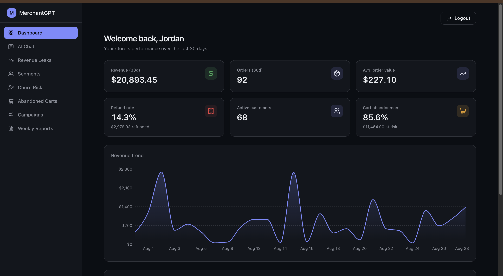
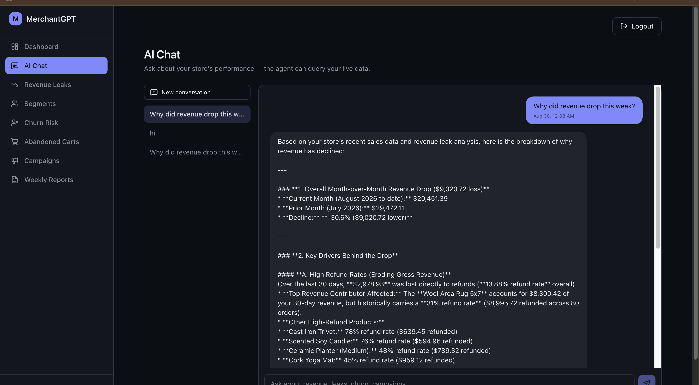
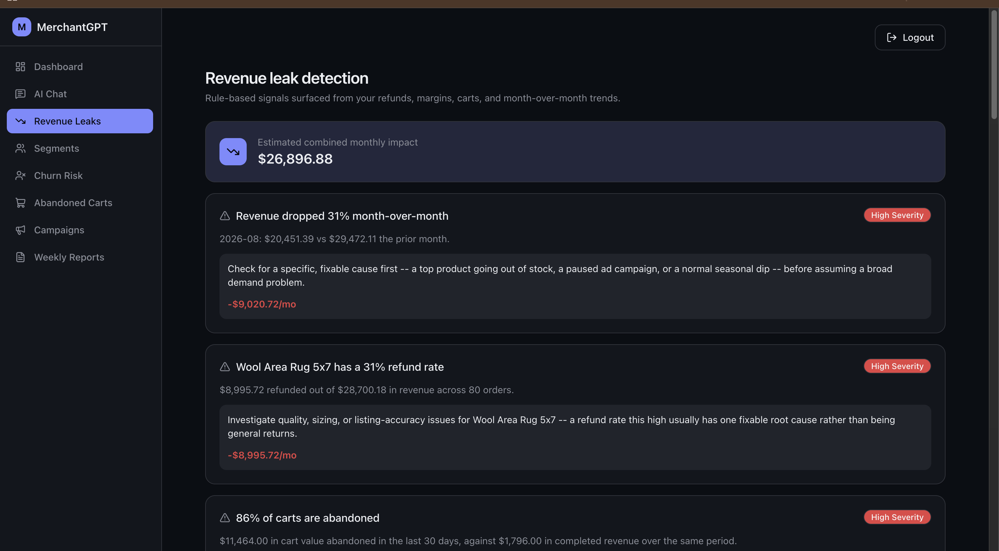
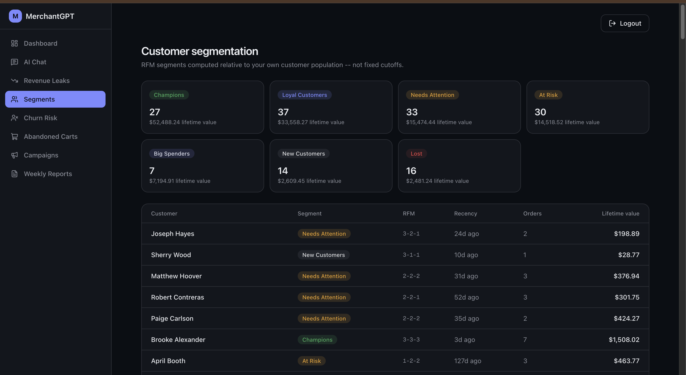

# MerchantGPT 🚀

> **Autonomous AI Growth Manager for E-commerce Merchants**

MerchantGPT is a production-grade AI SaaS platform that analyzes merchant sales, refunds, abandoned carts, customer behavior, and revenue trends, then generates actionable growth recommendations using **Gemini 3.6 Flash**, **FastAPI**, **PostgreSQL**, and **Next.js**.


---

# 📸 Screenshots

## Dashboard



## AI Chat



## Revenue Leak Detection



## Customer Segmentation



---

# ✨ Features

- 🤖 AI Chat powered by Gemini 3.6 Flash
- 🧠 SQL Tool Calling for live business analytics
- 📊 Executive Merchant Dashboard
- 💸 Revenue Leak Detection
- 🛒 Abandoned Cart Recovery
- 👥 RFM Customer Segmentation
- ⚠️ AI Churn Prediction
- 📣 Marketing Campaign Generator
- 📈 Weekly Executive Report
- 🔐 JWT Authentication
- 🧠 pgvector Chat Memory

---

# 🏗 Architecture

```text
          Next.js 15 Frontend
                  │
          REST API (JWT Auth)
                  │
             FastAPI Backend
                  │
     ┌────────────┼────────────┐
     │            │            │
PostgreSQL    pgvector     Gemini 3.6
 Analytics   Chat Memory   Tool Calling
```

---

# 🛠 Tech Stack

## Frontend

- Next.js 15
- TypeScript
- Tailwind CSS
- Recharts
- Lucide Icons

## Backend

- FastAPI
- SQLAlchemy
- PostgreSQL 18
- pgvector
- JWT Authentication

## AI

- Gemini 3.6 Flash
- Function / Tool Calling
- Context Memory
- Business Analytics

---

# 📊 AI Capabilities

MerchantGPT can answer questions like:

- Why did revenue drop this week?
- Which customers are most likely to churn?
- What products have the highest refund rates?
- Generate an abandoned cart recovery email.
- Create a campaign for loyal customers.
- Produce a CEO weekly executive report.

The AI retrieves real merchant data using SQL tools before generating responses.

---

# 🔑 Demo Credentials

| Field | Value |
|------|------|
| Email | `demo@aurorahome.example` |
| Password | `Demo@12345` |

---

# ⚙️ Local Setup

## Backend

```bash
cd backend

python -m venv .venv
source .venv/bin/activate

pip install -r requirements.txt

uvicorn app.main:app --reload
```

Backend runs at:

```text
http://localhost:8000
```

## Frontend

```bash
cd frontend

npm install

npm run dev
```

Frontend runs at:

```text
http://localhost:3000
```

---

# 🧠 AI Workflow

1. User asks a business question.
2. Gemini decides which analytical tool to invoke.
3. FastAPI executes SQL queries.
4. PostgreSQL returns structured merchant data.
5. Gemini generates an executive-quality business insight.
6. Conversation is stored using pgvector memory.

---

# 🧪 Testing

Run backend tests:

```bash
cd backend
pytest
```

**Result**

```text
37 passed in 0.12s
```

---

# 📁 Project Structure

```text
MerchantGPT
│
├── frontend/
│   ├── src/
│   └── components/
│
├── backend/
│   ├── app/
│   ├── scripts/
│   └── tests/
│
├── docs/
│   ├── dashboard.png
│   ├── chat.png
│   ├── leaks.png
│   └── segments.png
│
└── README.md
```

---

# 👨‍💻 Author

**Manish Kumar Reddy**

Built for the **Razorpay AI Builder Internship 2026**.

If you found this project interesting, consider giving it a ⭐.