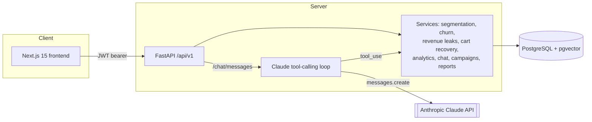
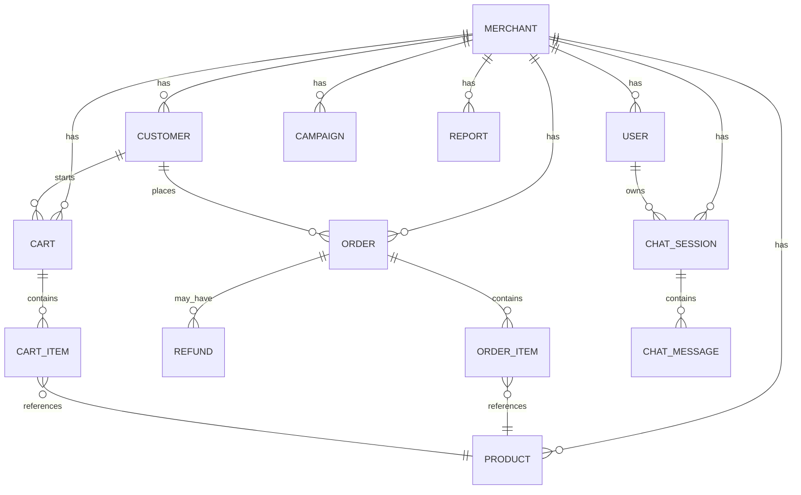

# Architecture

## Overview

MerchantGPT is a two-tier application: a Next.js frontend that talks to a FastAPI backend over a versioned REST API (`/api/v1`). The backend owns all business logic and data access; the frontend is a thin, typed client with no server-side data access of its own.

## Data model (ER diagram)

## Why these design choices

**Local, offline embeddings instead of an external embeddings API.** Chat memory retrieval uses a deterministic hashing bag-of-words embedding (`app/services/embedding.py`) rather than calling an external embeddings endpoint. This keeps semantic memory working even with zero external API keys, avoids per-message embedding cost/latency, and is sufficient for retrieving semantically related short chat turns within a single merchant's conversation history. It is not intended to compete with a trained embedding model on open-domain text.

**Rule-based / heuristic analytics instead of trained ML models.** Segmentation (RFM), churn risk, and revenue leak detection are all implemented as pure, deterministic functions over aggregated SQL data rather than trained models. There is no labeled churn/segment dataset to train against in a fresh merchant account, and rule-based logic is auditable and immediately explainable to a merchant ("why is this customer at risk?") -- which matters more than marginal accuracy gains from a black-box model at this stage. All thresholds are population-relative (e.g. RFM quantiles computed from the merchant's own customer distribution) rather than hardcoded absolute cutoffs, so the logic behaves sensibly for stores of very different sizes.

**Graceful AI degradation.** Every feature that can call Claude (chat, campaign copy polishing, weekly report narrative) has a deterministic fallback path and is designed to keep the rest of the product fully usable without `ANTHROPIC_API_KEY`. Only the free-form chat conversation itself has no non-AI equivalent, so it degrades to a clear "not configured" message instead of crashing.

**pgvector extension handled defensively.** On most managed Postgres hosts (Render, Supabase, Neon, RDS) the application's own database role cannot run `CREATE EXTENSION`. The backend attempts it on startup, catches the privilege error, logs a warning, and continues -- assuming an operator enabled the extension once via the host's dashboard, which matches how these hosts actually work in production.

## Request flow: AI chat turn

1. Frontend calls `POST /api/v1/chat/messages` with `{ session_id?, message }`.
2. `services/chat.py` embeds the message, retrieves the most recent messages plus the top-k semantically similar past messages (cosine distance over `pgvector`), and calls `agent/claude_client.py`.
3. The Claude tool-calling loop (`run_agent_turn`) sends the conversation plus tool schemas to Claude. If Claude requests a tool (`stop_reason == "tool_use"`), the backend executes it against the real database (`agent/tools.py` → `services/analytics.py`) and feeds the result back as a `tool_result` block, looping up to `MAX_TOOL_ITERATIONS` times.
4. The final assistant text is persisted (with its own embedding) alongside the user's message, and returned to the frontend along with which tools were called.
5. If `ANTHROPIC_API_KEY` is unset, this whole loop is skipped and a static explanatory message is persisted and returned instead -- the session and message history still work normally.
